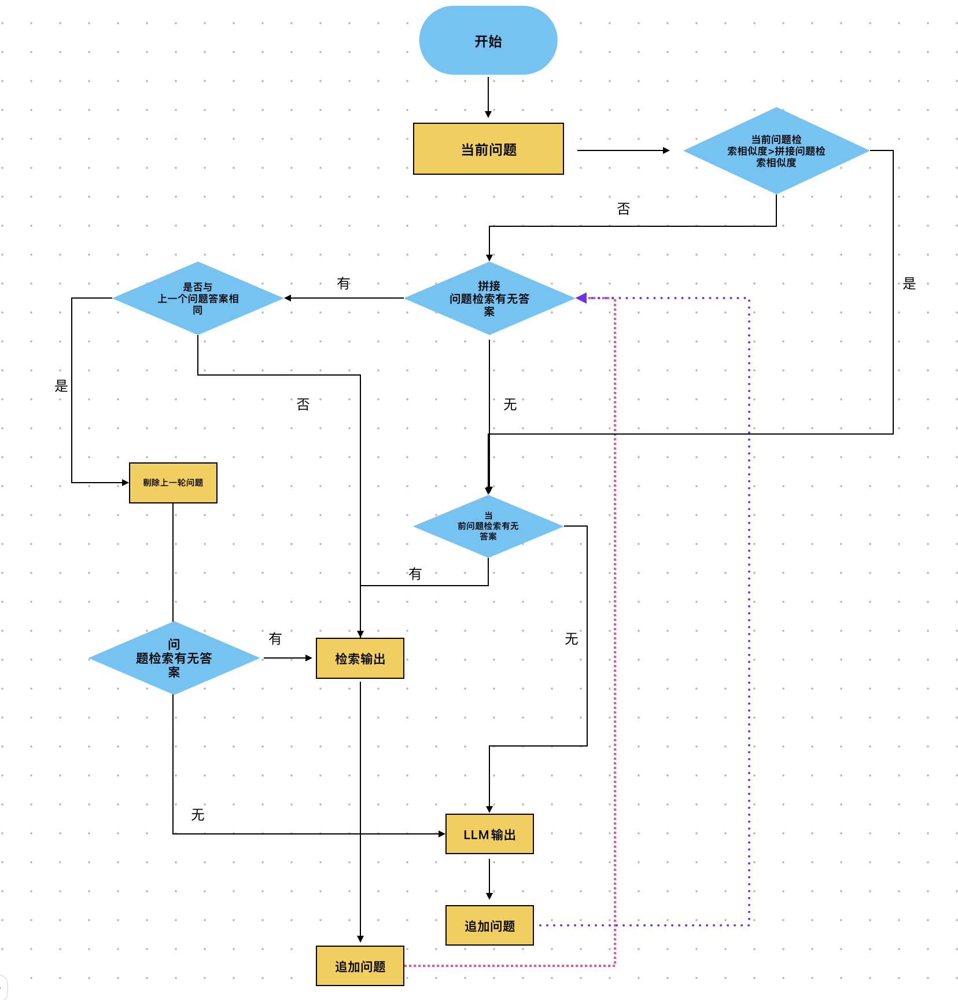
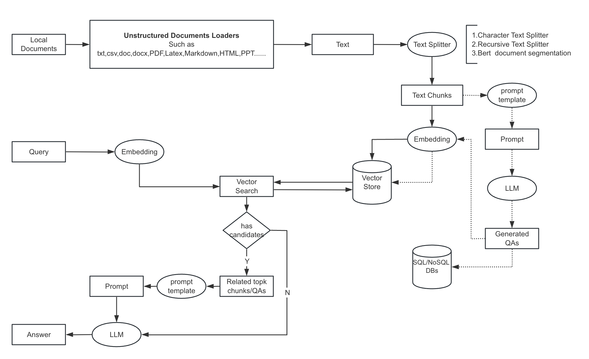

# 数字员工项目

## 介绍

🤖️ 一种利用 [langchain](https://github.com/hwchase17/langchain) 思想实现的基于本地知识库的问答应用，目标期望建立一套对中文场景与开源模型支持友好、可离线运行的知识库问答解决方案。

✅ 本项目中 Embedding 默认选用的是 [BAAI/bge-large-zh-v1.5](https://huggingface.co/BAAI/bge-large-zh-v1.5)，LLM 默认选用的是 [ChatGLM3-6B](https://github.com/THUDM/ChatGLM3)。依托上述模型，本项目可实现全部使用**开源**模型**离线私有部署**。


⛓️ 本项目实现原理如下图所示，过程包括加载文件 -> 读取文本 -> 文本分割 -> 文本向量化 -> 问句向量化 -> 在文本向量中匹配出与问句向量最相似的`top k`个 -> 匹配出的文本作为上下文和问题一起添加到`prompt`中 -> 提交给`LLM`生成回答。



从文档处理角度来看，实现流程如下：



## 硬件需求

- ChatGLM3-6B 模型硬件需求

    注：如未将模型下载至本地，请执行前检查`$HOME/.cache/huggingface/`文件夹剩余空间，模型文件下载至本地需要 15 GB 存储空间。
  
    | **量化等级**   | **最低 GPU 显存**（推理） | **最低 GPU 显存**（高效参数微调） |
    | -------------- | ------------------------- | --------------------------------- |
    | FP16（无量化） | 13 GB                     | 14 GB                             |
    | INT8           | 8 GB                     | 9 GB                             |
    | INT4           | 6 GB                      | 7 GB                              |

- Embedding 模型硬件需求

    本项目中默认选用的 Embedding 模型 [BAAI/bge-large-zh-v1.5](https://huggingface.co/BAAI/bge-large-zh-v1.5) 约占用显存 3GB，也可修改为在 CPU 中运行。

## 模型部署

- LLM 模型部署
  目前已使用开源项目[xusenlinzy/api-for-open-llm](https://github.com/xusenlinzy/api-for-open-llm)基于vllm部署大模型服务，解耦项目的GPU使用问题。

- Embedding 模型部署
  目前已使用[triton-inference-server/server](https://github.com/triton-inference-server/server),基于ensemble模式解耦项目的GPU使用。

## 开发部署

### 软件需求

本项目已在 Python 3.8.1 - 3.10，CUDA 11.7 环境下完成测试。已在 Windows、ARM 架构的 macOS、Linux 系统中完成测试。

### 1. 安装环境
```
$ pip install -r requirements.txt
```

### 2. 设置模型默认参数
在开始执行前，请先检查 [configs/model_config.py](configs/model_config.py) 中的各项模型参数设计是否符合需求。

### 3. 执行脚本体验 Web UI 或命令行交互
执行 [api.py](api.py) 利用 fastapi 部署 API
```shell
$ python api.py
```

# macos m系列芯片
conda install lxml 避免python-docx问题